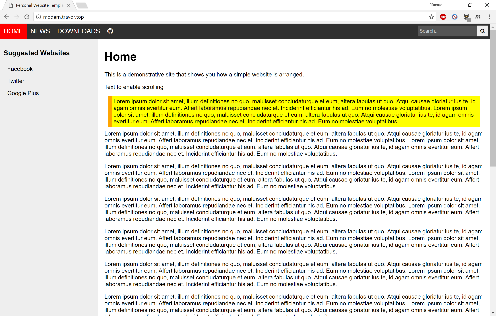
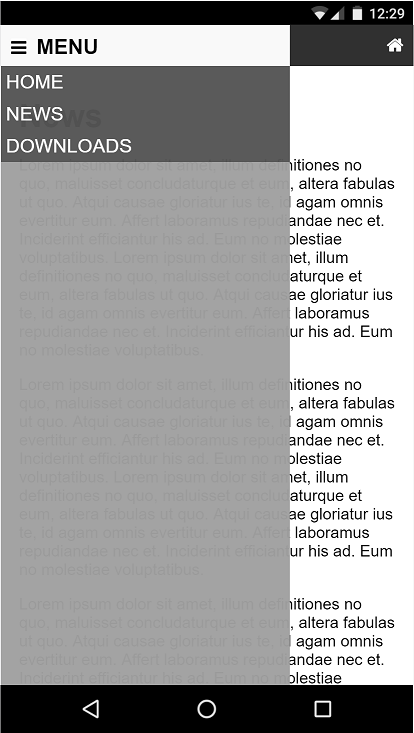

#  Travor's Modern Pages

This is inspired by my [GitHub Page][ghpage]. It's created for testing my ability in working on HTML 5 and CSS. It could be a `substitution` of my [current website][ghpage].

I uploaded it because it explicates how different pages are shown in one file. This decreases the use of multiple files. You may visit it [here](http://modern.travor.top)

> This repo `does not` requires Jekyll or any Server-Side script. You may run this page by clicking `index.html`.

This is what my website looks like

This is what it's like on phone. You may also stretch your browser to see the `responsive` effect

[ghpage]: http://www.travor.top

